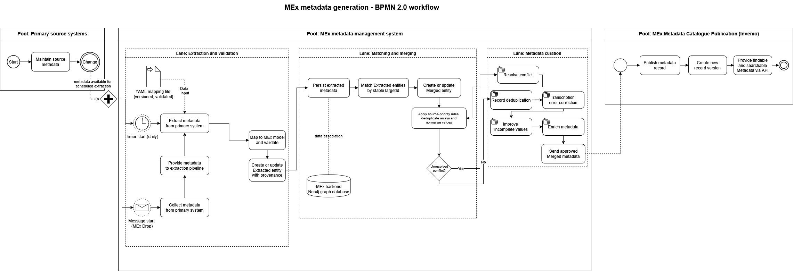
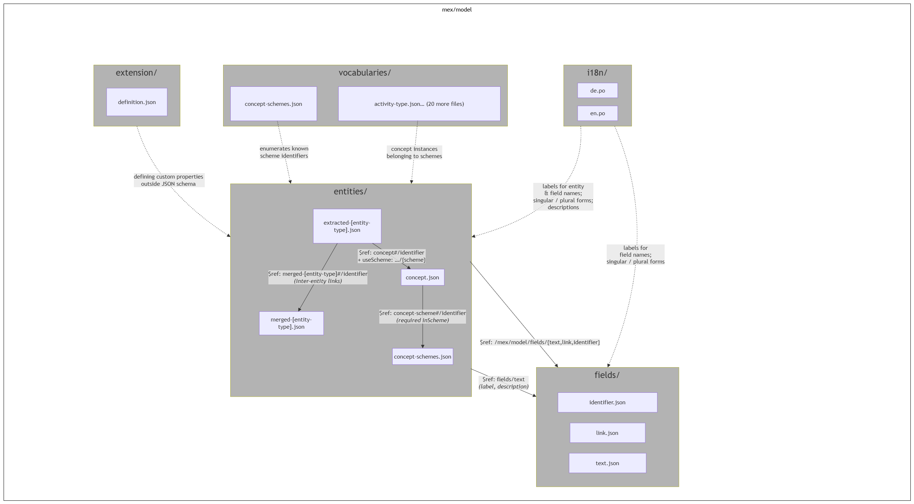

# How the Model Works

## Where the model is used

The MEx metadata model is not confined to a single application, but constitutes the backbone of multiple interconnected workflows across the MEx metadata management system. All components of the system that produce, process, or consume metadata might either be directly governed by the model or interfaces with a component that is. More precisely, the model is used in the following contexts:

* [mex-common](https://github.com/robert-koch-institut/mex-common): pydantic models: MEx is implemented as Python type definitions used by MEx components for validation and serialisation
* mex-assets & [mex-extractors](https://github.com/robert-koch-institut/mex-extractors): primary source mappings: ETL pipelines map source-system data to MEx entities when extracting metadata from primary systems
* [mex-admin](https://github.com/robert-koch-institut/mex-editor) & [mex-editor](https://github.com/robert-koch-institut/mex-editor-ng): the model defines available, required or optional fields for metadata editing
* [mex-invenio](https://github.com/robert-koch-institut/mex-invenio): the catalogue renders and exposes metadata records in conformance to the MEx model
* repositories: usage in data repositories for structured metadata

The following process diagram illustrates how these components relate within the overall MEx workflow:



## namespaces & prefixes

| Prefix | Namespace | Used for |
| --- | --- | --- |
| dcat: | http://www.w3.org/ns/dcat# | DCAT classes and properties |
| dcterms: | http://purl.org/dc/terms/ | Dublin Core terms such as title, description, identifier |
| prov: | http://www.w3.org/ns/prov# | Provenance concepts |
| foaf: | http://xmlns.com/foaf/0.1/ | Persons, organizations, pages |
| org: | http://www.w3.org/ns/org# | Organizational units and hierarchy |
| vcard: | http://www.w3.org/2006/vcard/ns# | Contact points |
| skos: | http://www.w3.org/2004/02/skos/core# | Concepts and concept schemes |
| dpv: | https://w3id.org/dpv# | Consent status / legal basis alignment |
| healthdcat: | http://healthdataportal.eu/ns/health# | HealthDCAT-AP classes and properties |
| dcatap: | https://www.dcat-ap.de/def/ (for references in mapping context) | DCAT-AP.de profile references |
| mex: | https://mex.rki.de/mex/model/ | MEx entity and field URIs |
| item: | https://mex.rki.de/item/ | Controlled vocabulary concept URIs |
| json-schema: | https://json-schema.org/ | Schema specification reference |
| iana: | https://www.iana.org/assignments/media-types/ | MIME types as controlled values / reference list |

## Repository layout & JSON file types

The MEx metadata model is defined entirely as a set of JSON files, maintained in the [RKI MEx-Model](https://github.com/robert-koch-institut/mex-model) Github repository. This machine-readable form is the authoritative source of truth for the model, with the specification being a derived and expanded subordinate to it.

The directory is divided into five subdirectories, each with a distinct role.

These directories are not independent. Entities reference field types via `$ref`, link to vocabularies via the custom useScheme keyword, and are labelled by the i18n files. The extension/ directory adds display and grouping metadata that the JSON Schema format cannot express natively.



## Entities, Fields, Extensions, Vocabularies

### Entities

Each entity in the model is defined as a standard JSON Schema document located in entities/. Entity types exist in two variants: Extracted and Merged. This results in two separate files per type (e.g. `extracted-resource.json` and `merged-resource.json`). The distinction between these variants is fundamental to the MEx architecture and will be covered in detail in the following section.
Within each entity file, the following JSON Schema keywords are used:

| Keyword | Purpose |
| --- | --- |
| properties | Declares all properties the entity can carry |
| required | Lists which properties are mandatory |
| $ref | References a reusable field type definition from fields/ranges |
| description | Human-readable description of each property |
| examples | Illustrative example values |
| useScheme | (Custom MEx keyword) Links a property to a controlled vocabulary |
| additionalProperties: false | Prohibits any properties not explicitly declared |

The model currently defines these entity types:

| Entity | Extracted/Merged | Description |
| --- | --- | --- |
| AccessPlatform | Yes | Technical system providing access to distributions |
| Activity | Yes | Research activity, project, or statutory task |
| BibliographicResource | Yes | Publication, article, or report |
| Concept | No | A single value from a controlled vocabulary, identified by URI |
| ConceptScheme | No | A named controlled vocabulary — a collection of Concepts |
| Consent | Yes | Data subject consent record |
| ContactPoint | Yes | Shared email address for a team |
| Distribution | Yes | A specific downloadable or accessible version of a dataset |
| Organization | Yes | External institution |
| OrganizationalUnit | Yes | RKI department or unit |
| Person | Yes | Individual researcher or contact |
| PrimarySource | Yes | Source system from which metadata is extracted |
| Resource | Yes | A dataset or data collection |
| Resource | Yes | Collection of resources published separately but grouped by shared characteristics |
| Variable | Yes | A single data variable within a resource |
| VariableGroup | Yes | A logical grouping of variables |

For all entity types that carry the extracted/merged distinction, the two variants reflect the two stages of the MEx data lifecycle. Extracted entities contain metadata taken directly from their primary source system, without modification. The Merged entities represent the normalised (and possibly manually corrected) consolidation of that data, potentially drawing from multiple primary sources. `Concept` and `ConceptScheme` do not follow this pattern as they are not sourced from external systems, but define the controlled vocabulary structure used across the model.

### Fields

The `fields/` directory contains three reusable atomic type definitions that are shared across entity schemas via $ref. Rather than repeating the same structural constraints in every entity file, field types are defined once and referenced wherever needed. The three field types are:

| Field | Description | Structure |
| --- | --- | --- |
| Identifier | A unique, opaque entity identifier | string matching `^[a-zA-Z0-9]{14,22}$, base62-encoded` |
| Link | A URL with optional title and language tag | url (required), title (optional), language (optional) |
| Text | A multilingual text value | value (required), language (optional) |

This keeps entity files concise and ensures consistency for structural changes to a shared type to all entities using it.

### Field Schema Detail

```{mex-field} identifier  ```
```{mex-field} link  ```
```{mex-field} text  ```

### Extension

The `extension/` directory contains a single file, definition.json. This defines three custom keywords that extend the JSON Schema vocabulary used by MEx entity files:

| Custom Keyword | Equivalent | Purpose |
| --- | --- | --- |
| useScheme | (MEx-specific) | Links a property to a controlled vocabulary concept scheme, identified by a URI matching `https://mex.rki.de/concept-scheme/...` |
| closeMatch | skos:closeMatch | Denotes a close semantic match between the MEx term and a term from an external ontology or data model |
| exactMatch | skos:exactMatch | Denotes an exact semantic match between the MEx term and a term from an external ontology or data model. This annotation property is used i.e. in matching terms from controlled vocabularies. |

These keywords are not part of the JSON Schema standard and will be ignored by generic JSON Schema validators. However, they are actively used within the MEx toolchain. Most notably, `useScheme` appears in entity schema files to link classification properties to their controlled vocabularies and is therefore integral to the model's behaviour.

### Vocabularies

The vocabularies/ directory contains the controlled value lists used by classification properties across entity types. Each vocabulary is a JSON file defining a named set of concepts, where every concept is identified by a URI of the form `https//mex.rki.de/item/...`
An entity property references a vocabulary through the custom `useScheme` keyword:

```JSON
{
  "accessRestriction": {
    "useScheme": "https://mex.rki.de/item/access-restriction",
    "examples": ["https://mex.rki.de/item/access-restriction-1"]
  }
}
```

The valid value for such a property is always the URI of a concept within the declared scheme, never a free-text string. This ensures machine-readability, unambiguous classification and mapping to EU-level controlled vocabularies where equivalents exist. More information on this can be found in the following subsection.

#### Internationalization (i18n)

The `i18n/` directory contains JSON files that map property names to human-readable labels in German (`de.json`) and English (`en.json`). These labels are used exclusively by UI components such as the MEx Editor and are not part of schema validation. They are non-normative from the perspective of this specification.

### How are vocabularies used

Controlled vocabularies in MEx serve as fixed reference lists for classification properties across entity types. Rather than accepting free-text input, properties that reference a vocabulary require a value in the form of a Concept URI. This is a stable, machine-readable identifier of the form `https://mex.rki.de/item/...` and ensures unambiguous, consistent classification that is both human-readable through the associated labels and ensures interoperability with external vocabulary systems.
Within an entity schema, a property is linked to its vocabulary through the custom useScheme keyword, defined in `extension/definition.json`. The following example shows how the accessRestriction property on a Resource declares its vocabulary reference:

```JSON
{
  "accessRestriction": {
    "useScheme": "https://mex.rki.de/item/access-restriction",
    "examples": ["https://mex.rki.de/item/access-restriction-1"]
  }
}
```

The value provided for such a property at runtime must be a URI of a Concept that belongs to the declared ConceptScheme. This enables automated validation of the values used.
Where MEx vocabularies correspond to established EU-level controlled vocabularies, such as EU Data Theme or IANA Media Types, MEx does not reference those external vocabularies directly. Instead, it maintains a local copy within the vocabulary/ directory of the repository, with its own Concept URIs. This is a deliberate design decision, primarily motivated by versioning control. By maintaining its own copy, MEx can update a vocabulary on its own schedule and ensure that the version in use at any given time is explicitly known and documented. A live reference to an external vocabulary, by contrast, would mean that changes made upstream, such as additions, deprecations, or restructuring of concept hierarchies, would take effect immediately and without a corresponding entry in the MEx changelog. This would possibly break existing records silently as validation routines would fail.

However, this approach also introduces a maintenance burden. Local copies must be actively kept in sync with their upstream sources, and divergence can accumulate over time. This risk is particularly pronounced for large vocabularies, such as country lists, where upstream changes may be frequent and where outdated values in MEx could lead to incorrect or incomplete classifications. Crucially, this synchronisation is only reliable if upstream changes are well-documented in the external vocabulary's own changelog, which cannot always be guaranteed.

Where a MEx vocabulary has an EU equivalent, values should be mappable to that external vocabulary. The relevant mapping is maintained alongside the vocabulary definition in the vocabularies/ directory. A full list of all vocabularies, their URIs, the entity properties that reference them, and their EU equivalents where applicable, is provided in the corresponding chapter.

## Extracted and Merged properties

### Why two variants exist

Every entity type in MEx that originates from a primary source system exists in two distinct variants: an Extracted and a Merged variant. This is the architectural mechanism through which MEx achieves provenance traceability while simultaneously presenting a clean, consolidated view of metadata to consumers.
The need the two-variant design addresses is standardisation: a real-world object, such as a research activity or a person for example, may be described across multiple primary source systems simultaneously, each with different levels of metadata completeness, different identifiers and potentially conflicting values (e.g. different titles or project durations). Collapsing these descriptions into a single record at ingestion time would destroy the information about where each piece of metadata came from and make it impossible to reconstruct or audit the original source data.

Beyond provenance, the two-variants are designed also to ensure addresses a practical the metadata's quality. Metadata as extracted directly from operational systems is frequently incomplete, inconsistently structured, or expressed in terms specific to that system, making it of limited use in a unified discovery context. The Merged variant provides the opportunity to enrich, normalise, and where necessary manually correct that data, producing a consolidated record that is usable across the RKI's metadata infrastructure.
This has direct implications for FAIR metadata principles. Findability requires consistent, searchable descriptions, which only the Merged layer can reliably provide. Interoperability requires a common structure and controlled vocabulary, enforced through the merging and normalisation process. Reusability requires sufficient context and quality, achieved through the enrichment the Merged variant makes possible. Regarding this, the two-variant design is MEx's architectural response to the FAIR challenge at an institutional scale.

### lifecycle

The lifecycle of a MEx entity follows a five-stage process chain:

1. metadata is identified and mapped from the primary source data structure to the mex-model,
2. extracted from primary systems and inserted into the standardised schema (mex-model),
3. edited where necessary (using the MEx Editor),
4. and finally published to make it findable (in the MEx metadata catalogue).
5. metadata is changed/edited in the primary system and/or the MEx Editor

The diagram above illustrates components involved at each stage.

#### Stage 1: Extraction

The lifecycle begins at the primary source systems. Automated extractors retrieve metadata from these systems on a daily basis and map it to MEx entities according to the transformation rules defined in versioned, validated YAML primary source mapping files. The result of this process is a set of Extracted entities, each carrying the metadata exactly as sourced, alongside the mandatory provenance properties (hadPrimarySource, identifierInPrimarySource, stableTargetId) that anchor the record to its origin. MEx Drop provides an alternative ingestion path, allowing metadata to be transferred directly from primary systems. This service allows data holders within the RKI to send their metadata directly to MEx, so MEx does not need to access any primary system itself, ensuring the protection of potentially sensitive data.

#### Stage 2: Storage and merging

Extracted entities are written to a neo4j graph database, which serves as the central store for all MEx metadata ([mex-backend](https://github.com/robert-koch-institut/mex-backend)). The merging service consolidates Extracted entities that share a `stableTargetId` into a single Merged entity, applying priority rules per primary source for scalar properties, deduplicating array values, and flagging conflicts for manual resolution. The graph database exposes its contents via a FastAPI-based API, used both by the MEx editor and the metadata catalogue.

<RECHECK HERE, SEE NIC's COMMENT>

#### Stage 3: Manual curation

The MEx editor connects directly to the graph database and provides a manual curation layer on top of the automated merging process. Curators use it to deduplicate records, correct transcription errors, improve incomplete values, and enrich metadata with authority data, including ingestion from sources such as Wikidata.

#### Stage 4: Publication

Merged, curated metadata is published to the Metadata catalogue, which runs on Invenio. The catalogue exposes metadata via API and provides dedicated landing pages for datasets, projects, publications, and variables, with a dedicated search view for the latter. This is the layer at which metadata becomes findable to internal and, where applicable, external users.
The entire process chain is overseen by an orchestration and management layer responsible for scheduling, monitoring and controlling pipeline runs.

#### Stage 5: Metadata updates / Stage 3.b

When Metadata changes in the primary system, the changes are caught by the extractors and the updates will be present in the MEx metadata management system the next day. The records are not versioned in the graph database, but changes are tracked by the metadata catalog, where each change creates a new version of the metadata record.
Metadata can also be edited and changed by using the MEx Editor. The MEx Editor introduces a rule-based editing mechanism, which is necessary to manage metadata provenance. The rules enable to switch on and off values. If a value is switched off, it will not be published to the metadata catalog. It is also possible to prevent the publication of values from the primary system. This causes, that no values from this primary system will be published, even if the values change in the primary system. The rules are enabled on the field-level, so the primary system can be switched off for a specific field.

### Merging rules and conflict resolution

When the merging service processes Extracted items that share a `stableTargetId`, it combines them into a single Merged item. Merging items is a manual process. When there are conflicting values for a metadata field, a metadata manager decides, which values takes preference in the Merged item.

## identifier system

### format

Every entity in MEx is assigned a unique identifier upon creation. Identifiers follow a fixed format: they are base62-encoded strings of between 14 and 22 characters, drawn from the alphanumeric character set (`a-zA-Z0-9`). This is enforced by the pattern constraint (`^[a-zA-Z0-9]{14,22}$`) defined in `fields/identifier.json`.

Identifier are intentionally opaque, they carry no embedded information about the entity type, origin or creation time. This is a deliberate design choice, an identifier's sole function is to uniquely and persistently reference a single entity within the MEx system.

There are 3 different type of identifiers in use for Extracted Entities:

1. `identifierInPrimarySource`: records the identifier used for the object in the originating primary source system. 
2. `identifier`: identifier of the extracted item, serving as an MEx-internal reference.
3. `stableTargetId`: the identifier of the corresponding merged item.

Merged Entities only have one `identifier`, which is the `stableTargetId` of the corresponding extracted item. Since a merged item can consist of multiple extracted items, it cannot have an `identifierInPrimarySource`.

### generation rules

Identifiers are generated by the MEx system and must not be constructed manually. Attempting to supply a self-constructed identifier, whether derived from a source system ID, a hash or any other internal input is not permitted and will result in an invalid record.
The generation of identifiers follows a clear distinction between the two entity variants:

* Extracted items receive a new identifier upon first each extraction. If the same item is extracted again in a subsequent pipeline run, the values are overwritten and the item keeps its identifier. The continuity of the item across runs is enabled by the `identifierInPrimarySource`, which guarantees the identification of the item in the primary system.
* Each Extracted item carries a `stableTargetId`, that references the corresponding Merged item. The `stableTargetId` corresponds to the identifier of the Merged item. This `identifier` is persistent across pipeline runs and must be used to referencing an entity from another entity, for example when a `Resource` references its responsible `OrganizationalUnit`.

### stability guarantees

MEx guarantees the consistent identification of the Extracted Item via `stableTargetId` and `hadPrimarySource`.

Since Extracted Items may be duplicates of each other, the relation between an Extracted Item and its originally associated Merged Item might change: When duplicate items are matched, the `stableTargetId` of an Extracted Item changes to a new Merged Item. Hence, MEx cannot guarantee a consistent relation between Extracted and Merged Items.

Nevertheless, the consistent identification of a Merged Item is guaranteed by MEx. The `MergedItem.identifier` is designed to be stable across system restarts, pipeline re-runs, or model version updates. This stability is a foundational system guarantee, as any external reference to a MEx entity needs to rely on the identifier remaining valid.

The usage of `identifier` and `stableTargetId` is planned in accordance to FAIR data principles to be used as URI.